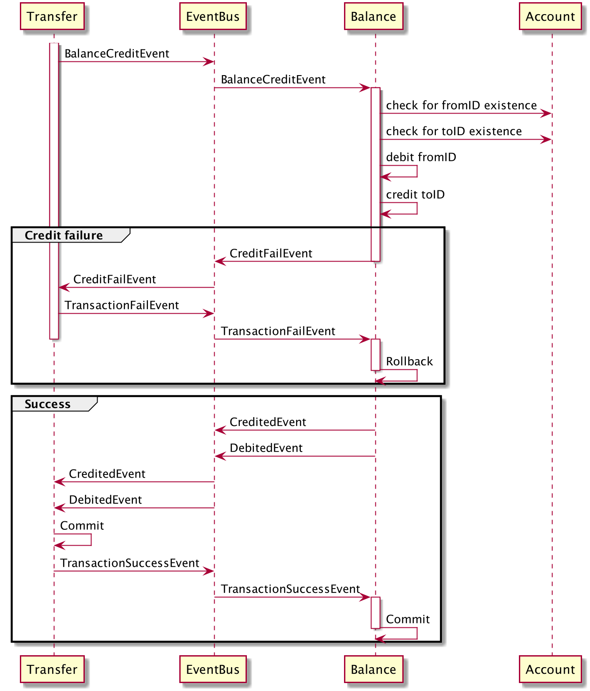

# Wallet

## Overview

This project implements simple wallet with distributed transactions based on Saga Pattern:



In `.docker/` there is a cluter with `Kafka`, `Zookeeper`, `Nginx`, `Prometheus`, `Grafana`, `Forwarder` and multiple instances of services.

I used a SOA approach. Services are independent of each other, they are implement `Service interface` and they are started and stopped by the `Lifecyle`.

I tried to do a good error handling with wrapping of original errors.

I did a code decoupling for better testability.

All services stop gracefully.

You could check the example of tests in `balance/service_test.go` There are:
* unit tests
* functional tests
* mocking

I did not cover everything with tests, just made an example.

I used `Prometheus` for measure all meaning places of the code. There are counters, gauges, histograms.

I did `Interface` for https://github.com/segmentio/kafka-go (in `pkg/kafka`) so you can make mocks for tests without actual Kafka cluster.

## How to use

To run account:

```
go run account/cmd/main.go run --config config.yaml
```

To run balance:

```
go run balance/cmd/main.go run --config config.yaml
```

To run transfer:

```
go run transfer/cmd/main.go run --config config.yaml
```


### Running the cluster

Go to `.docker/` folder and run:

```
docker-compose up -d
```

To stop:

```
docker-compose down
```

It should run following cluster:

* Kafka broker
* Zookeeper
* Nginx
* Account
* Balance
* Transfer
* API Gateway (WIP)
* Prometheus
* Grafana

After the start of everything, you could do requests on http://localhost:8080


## Todo
* API Gateway
* Go-Kit
* Kafka integration with exactly once semantics